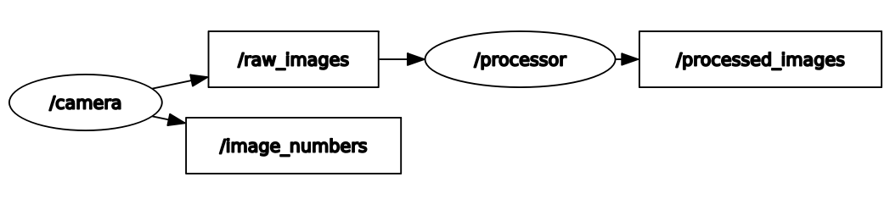

[rqt_graph]: https://github.com/rendermat/NeuroRacer/blob/master/Docs/Graph_Task_1_3.png "Kommunikation zwischen Publisher und Subscriber"

# Robot Operating System

**Namen:** Fabian Georgi (s0563263), Matthias Titze (s0563413)
**Dozent:** Patrick Baumann  
**Kurs:** KI in der Robotik  

# Table of contents
- [1. Theorie](#1-theorie)
    - [1.1 Nodes](#11-nodes)
	- [1.2 Messages](#12-messages)
	- [1.3 Topics](#13-topics)
	- [1.4 Master](#14-master)
- [2. Objective I - Erstellung eines Publishers & Subscribers](#2-objective-i)

# 1. Theorie <a name="1-theorie"/>
Bevor die Implementierung beginnt, sollten zunächst einige Grundlagen geklärt werden.

### 1.1. ROS Master

### 1.2 Nodes <a name="#11-nodes"/>
Eine Node ist in ROS ein gekapselter Prozess der Berechnungen ausführt. Sie kann durch eine ausführbare Datei innerhalb eines Paketes erzeugt werden. Nodes werden zu einem Graphen verknüpft und kommunizieren miteinander über ***Topics*** (Streams), ***RPC Dienste*** und den ***Parameter Server***. Jeder dieser Knoten stellt im Grunde eine Form von Microservice dar, der eine sehr eng umfasste Aufgabe erfüllt. Somit benötigt eine Robotersteuerung in der Regel viele Nodes.  
***Beispiel:*** In unserem Fall stellt eine Node die Sensoreingabe dar, eine weitere die Verarbeitung der Eingabe. Dazu gibt es die Kernsteuerung, welche wiederum eine AI-Komponente für die Auswertung und Analyse der Sensordaten nutzt. Es fällt leicht, sich weitere Komponenten, wie Bewegungssteuerung, Monitorausgabe etc. vorzustellen. Zusammenfassen eine Liste, der in diesem Projekt genutzten Nodes:

> - Camera
> - Processor
> - Controller
> - Predictor

Die Verwendung von Nodes hat einige Vorteile: Das System ist modular und kann im Verglich zu monolitischen Architekturen leicht erweitert werden. Auch erreichen wir eine gesteigerte Fehlertoleranz, da sich Abstürze auf einzelne Komponenten beschränken. Die Wiederverwendung und Nutzung von existierenden Bausteinen wird begünstigt, da klare Schnittstellen entstehen. Implementierungsdetails sind hingegen oft verborgen.

### 1.3 Messages <a name="#12-messages"/>
Eine Message ist ein Datentyp mit denen Knoten untereinander Informationen austauschen können. Sie stellen eine Art Standard zur Kommunikation dar, sodass Sender und Empfänger über des selbe Dateiformat sprechen.
### 1.4 Topics <a name="#13-topics"/>
Ein Topic stellt in etwa den Mittelsmann beim Informationsaustausch ist. Der Sender kann diese Nachrichten dort auf dem Topic "ablegen". Der Empfänger hat nun die Möglichkeit sich, wenn er das Topic abonniert hat, die Nachricht abzuholen. So findet die Kommunikation zwischen den zwei Nodes über ein Topic statt.
### 1.5 Master <a name="#14-master"/>
Der Master-Node stellt den obersten Knoten dar. Er ist der oberste Knoten im Graphen und verwaltet die anderen. Er überwacht die anderen Nodes und Ihre dazugehörigen Topics. Er sorgt dafür, dass sich die Nodes untereinander finden können, damit diese Informationen austauschen können. Des Weiteren stellt er den Parameterserver zur Verfügung, sodass dort Daten - ähnlich wie Environment-Variablen - verwaltet werden können. 

# 2. Objective I - Erstellung eines Publishers & Subscribers <a name="2-objective-i"/>
Ziel dieser Aufgabe ist es zwei Nodes bereitzustellen. Der erste Node (Talker/Cam) verschickt ein Bild und eine Zahl. Der zweite Node empfängt das Bild und bearbeitet es (z.B. schneidet das Bild zurecht). Dieses bearbeitete Bild sendet er wieder weiter.

Mittels rqt-graph lässt sich folgender Plot erstellen:  
 
*"Kommunikation zwischen Publisher und Subscriber"* 
Der `cam` Node verschickt einmal ein Integer an das `number_topic` und ein Bild an das `image_topic`. Der `processor` holt sich das Bild dort ab, bearbeitet und sendet es weiter an das `processed_image_topic`. Dort ist jedoch noch kein Subscriber, sodass es erstmal im Leeren landet.

