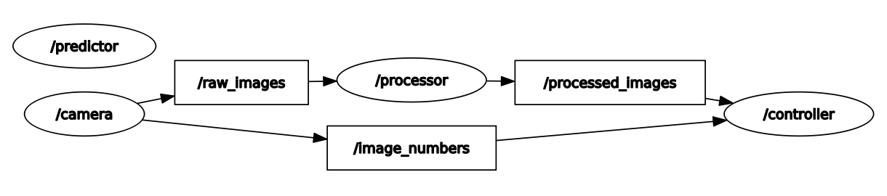
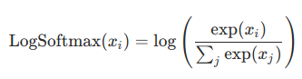
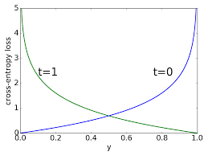
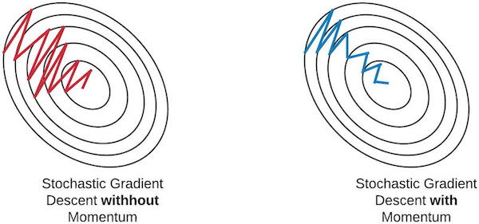
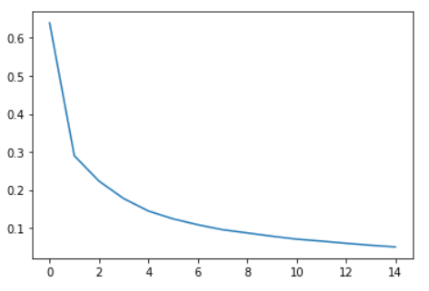

# Robot Operating System

**Namen:** Fabian Georgi (s0563263), <br> 			 Matthias Titze (s0563413) <br>
**Dozent:** Patrick Baumann <br>
**Kurs:** 	KI in der Robotik <br>

# Table of contents
- [1. Theorie](#1-theorie)
    + [1.1 Nodes](#11-nodes)
    + [1.2 Messages <a name="#12-messages"/>](#12-messages--a-name---12-messages---)
    + [1.3 Topics <a name="#13-topics"/>](#13-topics--a-name---13-topics---)
    + [1.4 Master <a name="#14-master"/>](#14-master--a-name---14-master---)
    + [1.5 Service <a name="15-service"/>](#15-service--a-name--15-service---)
- [2. Architektur - Number Sensor](#2-architektur---number-sensor)
- [3. AI-Modell - Neural Network](#3-ai-modell---neural-network)
    + [3.1 Architektur - Dense Layer Neural Network](#31-architektur---dense-layer-neural-network)
    + [3.2 Kostenfunktion](#32-kostenfunktion)
    + [3.3 Optimizer](#33-optimizer)
    + [3.4 Auswertung Training](#34-auswertung-training)
- [4. Deployment](#4-deployment)
    + [Docker Umgebung](#docker-umgebung)
    + [Projekt Bauen](#projekt-bauen)


# 1. Theorie
Bevor die Implementierung beginnt, sollten zunächst einige Grundlagen geklärt werden.
### 1.1 Nodes
Eine Node ist in ROS ein gekapselter Prozess der Berechnungen ausführt. Sie kann durch eine ausführbare Datei innerhalb eines Paketes erzeugt werden. Nodes werden zu einem Graphen verknüpft und kommunizieren miteinander über ***Topics*** (Streams), ***RPC Dienste*** und den ***Parameter Server***. Jeder dieser Knoten stellt im Grunde eine Form von Microservice dar, der eine sehr eng umfasste Aufgabe erfüllt. Somit benötigt eine Robotersteuerung in der Regel viele Nodes.<br>Die Verwendung von Nodes hat einige Vorteile: Das System ist modular und kann im Verglich zu monolitischen Architekturen leicht erweitert werden. Auch erreichen wir eine gesteigerte Fehlertoleranz, da sich Abstürze auf einzelne Komponenten beschränken. Die Wiederverwendung und Nutzung von existierenden Bausteinen wird begünstigt, da klare Schnittstellen entstehen. Implementierungsdetails sind hingegen oft verborgen.
### 1.2 Messages
Eine Message ist ein Datentyp mit denen Knoten untereinander Informationen austauschen können. Sie stellen eine Art Standard zur Kommunikation dar, sodass Sender und Empfänger über das selbe Dateiformat sprechen.
### 1.3 Topics
Ein Topic bildet in etwa den Mittelsmann beim Informationsaustausch. Der Sender kann Nachrichten auf dem Topic "ablegen". Der Empfänger hat nun die Möglichkeit sich, wenn er das Topic abonniert hat, die Nachricht abzuholen. So findet die Kommunikation zwischen den zwei Nodes über ein bezeichneten Stream statt. Im Grunde genommen entspricht diese Architektur dem Publisher-Subscriber-Prinzip bei Internetservices.
### 1.4 Master
Der Master `roscore` ist die Registry in einem ROS-System. Er überwacht die anderen Nodes und Ihre dazugehörigen Topics. Er sorgt somit dafür, dass sich die Nodes untereinander finden können, wenn diese Informationen austauschen wollen. Des Weiteren stellt er den Parameterserver zur Verfügung, sodass dort Daten - ähnlich wie Environment-Variablen - verwaltet werden können.
### 1.5 Service
Der Service ist eine Definition für ein Client-Server-System. Er definiert einen Austauschkanal bei dem der Client einen Request an den Server sendet und von diesem eine Antwort erhält. Folglich sind an dem System mindestens zwei Nodes, wo bei eine der Client und der andere Server ist. Es könnten aber auch mehrere Clients den Server bedienen. Im Vergleich zum Topic ist anzumerken, dass das Absenden eines Request den Client zeitweilig blockiert bis die Antwort der Servers ankommt (synchrone Kommunikation). 


# 2. Architektur - Number Sensor
**Nodes:** In unserem Fall stellt eine Node die Sensoreingabe dar, eine weitere die Verarbeitung der Eingabe. Dazu gibt es die Kernsteuerung, welche wiederum eine AI-Komponente für die Auswertung und Analyse der Sensordaten nutzt. Es fällt leicht, sich weitere Komponenten, wie Bewegungssteuerung, Monitorausgabe etc. vorzustellen. Zusammenfassend seien hier die in diesem Projekt genutzten Nodes aufgelistet:

 - Camera
 - Processor
 - Controller
 - Predictor

**Graph:** Die erste Node `/camera` verschickt ein Bild, das einem Videoinput simuliert. Der zweite Knoten `/processor` empfängt dieses Bild und bearbeitet es (Reduktion auf Graustufen). Das bearbeitete Bild sendet er wieder weiter an den Steuerungsknoten `/controller`. Die Kamara verschickt des Weiteren eine Nummer, die die auf dem Bild dargestellte Zahl identifiziert. Der Controller empfängt diese Nummer und speichert sie zusammen mit dem vorverarbeiteten Bild ab. Nun wird das Bild an die AI-Komponente `/predictor` verschickt. Dieser analysiert es mit einem trainierten Neuronalen Netz und macht eine Voraussage über die abgebildete Nummer. Diese Voraussage returniert er. Der Controller kann nun beide Ergebnisse abgleichen.

<br>

**Kommunikation Kamera - Pre-Prozessor:** Die Kommunikation erfolgt über den Topic-Stream `/raw_images`. Das Kamaramodul ist Publisher der Nachricht und die Prozessor-Node der Subscriber. Das Nachritenformat ist die ROS Standard Sensor-Image-Message. 

<br>

**Kommunikation Pre-Prozessor - Controller:**  Diese Kommunikation erfolgt ebenfalls über eine Topic: `/processed_images`. Der Controller ist außerdem Abonnent des Topics `/image_numbers`.

**Kommunikation Controller - Predictor:**  Der Datentransfer wird hier mittels eines Services realisiert. Der `/controller` sendet das Bild synchron zum `/predictor`. Dieser analysiert das Bild und fällt auf Grundlage des Neuronalen Netzes seine Entscheidung. Er veruscht also die Zahl vorherzusagen, die er meint, die auf dem Bild dargestellt ist. Das Ergebnis wird zum `/controller` zurück gesendet. Anschließend werden die beiden Werte - reale Zahl von der `/camera` und die vorhergesagte Zahl vom `/predictor` verglichen, sodass eine Evaluation des Neuronalen Netzen ermöglicht wird. 

# 3. AI-Modell - Neural Network

Als Framework für das Neuronale Netywerk verwenden wir **PyTorch**.

### 3.1 Architektur - Dense Layer Neural Network

Das Modell besteht aus 4 Layern, plus zwei Aktivierungschichten. Im ersten Layer - dem sogenannten **Input-Layer** - verarbeiten 784 Neuronen jeweils das einzelne Bild. Dabei wird das 28x28x1 (Greyscale) MNIST-Bild in einen langen Vektor transponiert, sodass er die Dimension 784x1 erreicht. Das ermöglicht mittels einer Matrixmultiplikation eine sehr performante Klassifikation (auch von mehreren Bildern im Batch).

Es handelt sich hierbei um ein Fully-Connected Neuronales Netzwerk. Das bedeutet, dass jedes Neuron der n-ten Schicht mit jedem Neuron in der n+1-ten Schicht verbunden ist. Es ist also "vollkommen vernetzt". Jeder dieser Stränge (Kanten im Graph) stellt ein Gewicht dar. Die einzelnen Ausgabewerte eines jeden Neurons werden also mit einem spezifischen Gewicht multipliziert und anschließen mit einem Bias addiert. Die Manipulation dieser Gewichte ist der eigentliche Lernprozess des Neuronalen Netzwerks.

**Aktivierungslayer:** Zwischen diesen Fully-Connected-Layern liegen Aktivierungslayer. Sie sorgen dafür, dass das Ausgabesignal eines Neurons nach der Berechnung in einen definierten Wertebereich abgebildet wird. In dieser Architektur wurde sich für die am verbreiteste Aktivierungsfunktion entschieden: ReLU (Rectified Linear Unit) `f(x) = max(0,x)`. Hier wird der Wertebereich also nach [0, ∞) verschoben, also faktisch gesagt, alle positiven Werte werden "durchgelassen" und die negativen auf 0 gesetzt.

 **Output-Layer:** In der letzten Schicht - dem sogenannten Output-Layer - finden Sich nur noch 10 Neuronen, die potenziellen Klassen widerspiegeln (0, ..., 9). Hier wird dann als Aktivierungsfunktion die Softmax-Funktion genutzt. Sie bildet den Wertebereich auf [0,1] ab und hat desweiteren die Eigenschaft, dass die Summe aller Werte wiederum 1 ergeben. Das erinnert doch stark an die Stochastik, sodass wir diese Werte als einfache Wahrscheinlichkeiten betrachten können. Der höchste Wert ist also ausschlaggebend - da es laut dem Modell am wahrscheinlichsten ist -, sodass sich für diese dann entschieden wird.

Im Folgenden ist einmal die Architektur mit der Anzahl der Neuronen in den einzelnen Schichten und den jeweiligen Aktivierungsfunktionen in jeder Schicht zu sehen:

 

### 3.2 Kostenfunktion

**Ausgabeschicht:** Als Ausgabeschicht verwenden wir die logarithmische Softmax-Funktion (siehe oben). In der Warscheinlichkeitstheorie kann die Ausgabe der Softmax-Funktion genutzt werden, um eine kategoriale Verteilung – also eine Wahrscheinlichkeitsverteilung über K unterschiedliche mögliche Ereignisse – darzustellen. Es gibt eine Reihe von Gründen, die logarithmische Version dieser Funktion zu benutzen, darunter: eine bessere numerische Performanz und Gradientenoptimierung. Diese Vorteile können sehr wichtig werden, wenn das Training eines Modells sehr anspruchsvoll und rechenintensiv wird. Im Wesentlichen hat der Gebrauch von logarithmischen Wahrscheinlichkeiten anstatt von einfachen Warscheinlichkeiten gute informationstheoretische Implikationen für Klassifikationsprobleme. Das Modell wird in diesem Fall stärker bestraft, wenn es nicht die korrekte Klasse voraus sagt.

<br>

**Loss-Funktion:** Passend zur logarithmischen Softmax-Funktion nutzen wir die Cross-Entropy als Kostenfunktion. Diese passt besser zu als zum Beispiel der Mean Squared Error (MSE), das sie eine deutlich günstigere Hyperebene für den Gradientenabstieg erzeugt. Die Steigungen fallen hier kontinuierlicher zum Minimum ab.

<br>

**Anmerkung:** Eigentlich haben wir die negtive Likelyhood-Function (NLL) verwendet. Diese wirkt in Zusammenhang mit den logarithmischen Ausgaben der letzten Schicht aber als Cross-Entropy.

### 3.3 Optimizer

Um den Gradientenabstieg durchzuführen benötigen wir einen Optimizer. Dieser legt im Grunde genommen fest, wie ein Abstiegsschritt im Verhältnis auf die lokale Steigung der Kostenlandschaft (Hyperebene) auszuführen ist. Wir verwenden den **Stochastischen Gradient Decent**, der den Abstiegsschritt nach jeden Lernsample ansetzt. Ein einfacher Gradient Decent müsste zunächt alle Lerndaten sehen, bevor eine Update der Gewichte erfolgen kann. Diese Reduktion der Durchgänge erzeugt einen "wackeligeren", ungenauen Abstiegspfad, der sich aber im Mittel ausgleicht. Der Gewinn ist eine schnellere Berechnung. Bei PyTorch ist der SGD zudem mit Momentum versehen. D.h. wir speichern information über die vorherigen Abstiege in Form einer Geschwindigkeit. Bildlich veranschaulichen lässt sich das gespeicherte Momentum als Schwung einer Kugel, die den Hang hinabrollt. Der Abstieg wird dabei robuster und verfängt sich nicht so schnell in lokalen Minima. Die Berechnung des Abstiegsschrittes mit Momentum begünstigt auch ein Glattziehen der Abweichungen durch den stochastischen Ansatz.

<br>


### 3.4 Auswertung Training

**Training:** Das Modell wurde über 15 Epochen trainiert. Die Kosten fielen dabei zügig und stetig von 0.64 zu 0.052 ab. Nach 13 Epochen verändern sich die Kosten nunmehr im Bereich der dritten Nachkommastelle. Ein weiteres Training scheint hier nicht unbedingt sinvoll, da einer deutlichere Anpassung and den Trainingsdatensatz auch die Gefahr von Overfitting birgt. In diesem Fall würde sich zwar die Genauigkeit der Aussage über dem Trainingsdatensatz verbessern, ungesehene Daten würden aber schlechter eingeordnet (Generalisierungsfehler). Für das Training stellt MNIST 60 000 Samples zur Verfügung.

Dieser Graph zeigt den Verlauf der Kosten über 15 Epochen Training.

<br>

**Validierung:** Getestet wurde das Modell mit 1000 ungesehenen Samples. Die **Accuracy liegt bei: 0.9721** also in etwa 97%. Das ist ein gutes Ergebnis, welches sich in der Anwendung innerhalb des ROS-Systems bestätigt. Von den im Projekt als Sensordaten eingelesenen Bildern wurde keines falsch klassifiziert.

# 4. Deployment 

### Docker Umgebung

Wir können das Projekt in einem Docker-Container ausführen, der ein Ubuntu Linux und die passende ROS Melodic Installation enthält. Dazu ist folgenden Image zu beziehen:

```bash
# Pull the base image.
$ docker pull neurorace/simulation-base
```

Der Docker-Container muss aus dem Image gebaut werden:

- Er erhält den Namen `neurorace`.
- Wir linken das Volumen mit den Quellcode des Projekts ein - der Pfad ist anzupassen.
- Wir setyen die `DISPLAY`-Variable, um X-Server Gui-Projektion of den Host zu erlauben.
- Schließlich startet der Conatiner in `bash`, damit er nicht gleich wieder runter fährt.

```bash
# Create a container from the image and set it to run bash.
$ docker run -it --name neurorace \
    -v <path>/NeuroRacer/Container:/home \
    -e DISPLAY=192.168.2.107:0 \
    neurorace/simulation-base \
    bash
```

### Projekt Bauen

Vor der Ausführung muss das Projekt gebaut werden.

```bash
# Goto catkin workspace.
$ cd ../home/catkin_ws/
```

```bash
# Build the projekt with catkin.
$ catkin_make
```

```bash
# Source the required setup bash scripts.
$ source /opt/ros/melodic/setup.bash && source /home/catkin_ws/devel/setup.bash
```

Nun können wir das Projekt mit `roslaunch` ausführen.

```bash
# Start the core service.
$ roscore
```

```bash
# Use roslaunch to start all the nodes.
$ roslaunch number_sensor sensor.launch
```

Für Anzeige des Graphen kann RQT als GUI verwendet werden. Dieses ist eventuell nachzuinstallieren.

```bash
# Add the ROS repository to apt.
$ sudo sh -c 'echo "deb http://packages.ros.org/ros/ubuntu $(lsb_release -sc) main" > /etc/apt/sources.list.d/ros-latest.list'
$ sudo apt-key adv --keyserver 'hkp://keyserver.ubuntu.com:80' --recv-key C1CF6E31E6BADE8868B172B4F42ED6FBAB17C654
$ sudo apt update
# Install ros RQT and common plugins.
$ sudo apt-get install ros-melodic-rqt
$ sudo apt-get install ros-melodic-rqt-common-plugins
```

Starte RQT und nutze die GUI, um das System zu analysieren.

```bash
# Start rqt
$ rqt
```


